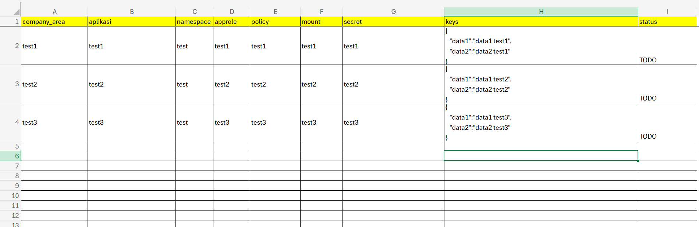
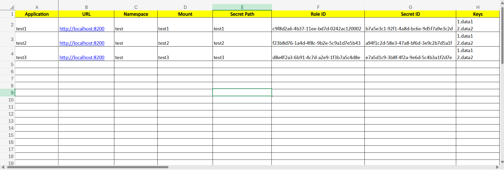

# Vault Secret Setup

## Overview
This repository contains a script to automate the creation of Vault secrets. The script performs the following tasks:
- Creates a Vault secret engine (mount).
- Adds secret data.
- Defines policies.
- Sets up an AppRole authentication method.
- Generates Role ID and Secret ID.
- Reads input data from `vault_input.xlsx`.
- Stores the generated Vault credentials in `vault_output.xlsx`.

## Prerequisites
Ensure you have the following installed before proceeding:
- [HashiCorp Vault](https://developer.hashicorp.com/vault/docs/install)
- Python 3.x
- `pip` (Python package manager)
- `virtualenv` (for environment isolation)

## Installation

### 1. Clone the Repository
```bash
git clone https://github.com/SyifaMohNaufal/vault-secret-setup.git
cd vault-secret-setup
```

### 2. Set Up a Virtual Environment
```bash
python -m venv venv  # Create a virtual environment
source venv/bin/activate  # On macOS/Linux
venv\Scripts\activate  # On Windows
```

### 3. Install Dependencies
```bash
pip install -r requirements.txt
```

### 4. Set Up Environment Variables
Copy the `.env.example` file and rename it to `.env`:
```bash
cp .env.example .env  # On macOS/Linux
copy .env.example .env  # On Windows
```
Fill in the `.env` file with your Vault address and Vault root token.

## Usage

### 1. Prepare Input Data
Before running the script, make sure to:

Copy the template files:

- `vault_input_dev.example.xlsx` → `vault_input_dev.xlsx`

- `vault_input_prod.example.xlsx` → `vault_input_prod.xlsx`

Edit `vault_input_dev.xlsx` and/or `vault_input_prod.xlsx` with the necessary details before running the script..

These copied files are ignored by Git to prevent accidental exposure of sensitive information.


### 2. Run the Script
For Development environment use this command
```bash
python vault_setup_dev.py
```
For Production environment use this command
```bash
python vault_setup_prod.py
```


### 3. Output
After execution, the generated Vault credentials will be stored in `vault_output.xlsx`.


## License
This project is licensed under the MIT License.

## Author
[Syifa Mohammad Naufal](https://github.com/SyifaMohNaufal)

